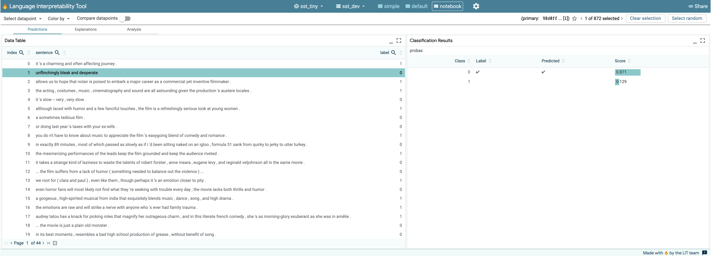
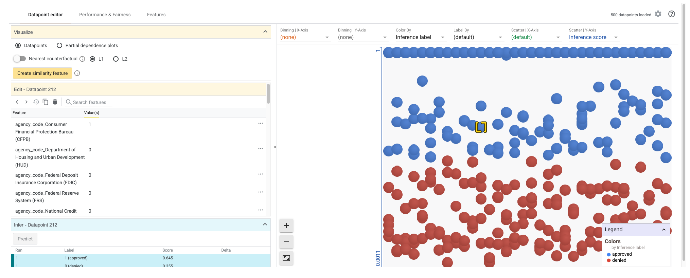
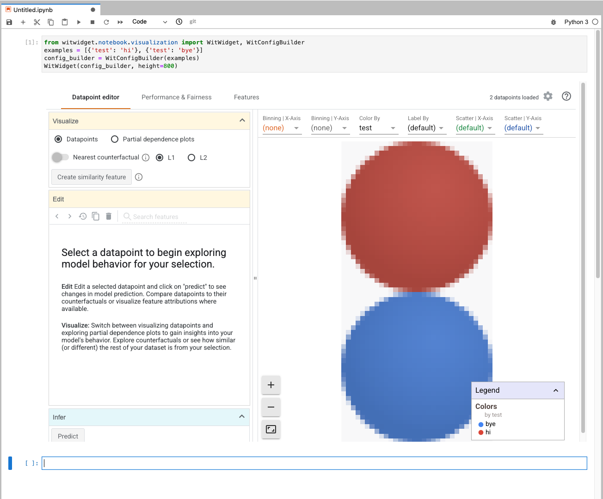
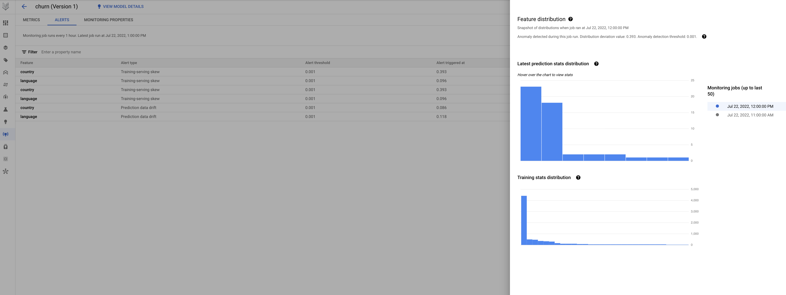

# Vertex AI Explainability and Monitoring Labs

This repository contains sample codes for Vertex Prediction, and also Vertex AI Explainability and Monitoring.


## Lab 1: Simple online and batch prediction

Simple prediction on a Keras model with the ULB dataset (fraud detection model). First, train the model with `python3 custom_training_simple`. Next, for both online and batch, make sure you modify the `endpoint_id` and `model_id` in the source code accordingly.

* **Online predict:** Input format (note can actually be multiple inputs):
```python
response = endpoint.predict([{'Time': 80422,'Amount': 17.99,'V1': -0.24,'V2': -0.027,'V3': 0.064,'V4': -0.16,'V5': -0.152,'V6': -0.3,'V7': -0.03,'V8': -0.01,'V9': -0.13,'V10': -0.13 ,'V11': -0.16,'V12': 0.06,'V13': -0.11,'V14': 2.1,'V15': -0.07,'V16': -0.033,'V17': -0.14,'V18': -0.08,'V19': -0.062,'V20': -0.08,'V21': -0.06,'V22': -0.088,'V23': -0.03,'V24': -0,15, 'V25': -0.04,'V26': -0.99,'V27': -0.13,'V28': 0.003}])
API response:  Prediction(predictions=[[1.0]], deployed_model_id='4992706379870371840', explanations=None)
```

* **Batch predict:** Input format, content of file [batch_ulb_gcs_5.jsonl](batch_ulb_gcs_5.jsonl), that must be uploaded to GCS before launching the batch prediction job:
```json
{"Time": 80422, "Amount": 17.99, "V1": -0.24, "V2": -0.027, "V3": 0.064, "V4": -0.16, "V5": -0.152, "V6": -0.3, "V7": -0.03, "V8": -0.01, "V9": -0.13, "V10": -0.18, "V11": -0.16, "V12": 0.06, "V13": -0.11, "V14": 2.1, "V15": -0.07, "V16": -0.033, "V17": -0.14, "V18": -0.08, "V19": -0.062, "V20": -0.08, "V21": -0.06, "V22": -0.088, "V23": -0.03, "V24": 0.01, "V25": -0.04, "V26": -0.99, "V27": -0.13, "V28": 0.003}
{"Time": 80522, "Amount": 18.99, "V1": -0.24, "V2": -0.027, "V3": 0.064, "V4": -0.16, "V5": -0.152, "V6": -0.3, "V7": -0.03, "V8": -0.01, "V9": -0.13, "V10": -0.18, "V11": -0.16, "V12": 0.06, "V13": -0.11, "V14": 2.1, "V15": -0.07, "V16": -0.033, "V17": -0.14, "V18": -0.08, "V19": -0.062, "V20": -0.08, "V21": -0.06, "V22": -0.088, "V23": -0.03, "V24": 0.01, "V25": -0.04, "V26": -0.99, "V27": -0.13, "V28": 0.003}
{"Time": 80622, "Amount": 19.99, "V1": -0.24, "V2": -0.027, "V3": 0.064, "V4": -0.16, "V5": -0.152, "V6": -0.3, "V7": -0.03, "V8": -0.01, "V9": -0.13, "V10": -0.18, "V11": -0.16, "V12": 0.06, "V13": -0.11, "V14": 2.1, "V15": -0.07, "V16": -0.033, "V17": -0.14, "V18": -0.08, "V19": -0.062, "V20": -0.08, "V21": -0.06, "V22": -0.088, "V23": -0.03, "V24": 0.01, "V25": -0.04, "V26": -0.99, "V27": -0.13, "V28": 0.003}
[...]
```

Output of batch prediction in GCS. Note results **may not be in order** and splitted in multiple files (pattern `prediction.results-000XX-of-000TT`, depending on the number of workers used:
```json
{"instance": {"Time": 80422, "Amount": 17.99, "V1": -0.24, "V2": -0.027, "V3": 0.064, "V4": -0.16, "V5": -0.152, "V6": -0.3, "V7": -0.03, "V8": -0.01, "V9": -0.13, "V10": -0.18, "V11": -0.16, "V12": 0.06, "V13": -0.11, "V14": 2.1, "V15": -0.07, "V16": -0.033, "V17": -0.14, "V18": -0.08, "V19": -0.062, "V20": -0.08, "V21": -0.06, "V22": -0.088, "V23": -0.03, "V24": 0.01, "V25": -0.04, "V26": -0.99, "V27": -0.13, "V28": 0.003}, "prediction": [1.0]}
{"instance": {"Time": 80422, "Amount": 17.99, "V1": -0.24, "V2": -0.027, "V3": 0.064, "V4": -0.16, "V5": -0.152, "V6": -0.3, "V7": -0.03, "V8": -0.01, "V9": -0.13, "V10": -0.18, "V11": -0.16, "V12": 0.06, "V13": -0.11, "V14": 2.1, "V15": -0.07, "V16": -0.033, "V17": -0.14, "V18": -0.08, "V19": -0.062, "V20": -0.08, "V21": -0.06, "V22": -0.088, "V23": -0.03, "V24": 0.01, "V25": -0.04, "V26": -0.99, "V27": -0.13, "V28": 0.003}, "prediction": [1.0]}
{"instance": {"Time": 80422, "Amount": 17.99, "V1": -0.24, "V2": -0.027, "V3": 0.064, "V4": -0.16, "V5": -0.152, "V6": -0.3, "V7": -0.03, "V8": -0.01, "V9": -0.13, "V10": -0.18, "V11": -0.16, "V12": 0.06, "V13": -0.11, "V14": 2.1, "V15": -0.07, "V16": -0.033, "V17": -0.14, "V18": -0.08, "V19": -0.062, "V20": -0.08, "V21": -0.06, "V22": -0.088, "V23": -0.03, "V24": 0.01, "V25": -0.04, "V26": -0.99, "V27": -0.13, "V28": 0.003}, "prediction": [1.0]}
```


## Lab 2: LIT with Kaggle happyDB dataset (NLP)

This lab shows the [Kaggle happyDB dataset](https://www.kaggle.com/ritresearch/happydb). You can see how to create an AutoML NLP model in [this tutorial](https://cloud.google.com/natural-language/automl/docs/quickstart). The simplified dataset used in this lab is publicly available at GCS at `gs://cloud-ml-data/NL-classification/happiness.csv` and contains 7 labels (affection, bonding, achievement, nature, exercise, enjoy_the_moment, leisure)

Steps:
1. Check the happyDB dataset at [Kaggle page](https://www.kaggle.com/ritresearch/happydb), and show the AutoML NLP tutorial main page.
2. Import the dataset in Vertex AI and train an AutoML text classification model. This will take time.
3. Show a prediction from the UI console.
4. Install LIT widget with `pip3 install lit_nlp` 
5. After that, use LIT to show explainability by launching `predict_lit.py` within a Vertex Workbench. This is a multiclass classification model (NLP) for the happyness dataset. use the following test data:
```csv
text,label,docID
I ran 4 kilometers at the park.,4,22588212
I planted to build a garden in my house.,3,19151312
I went bouldering at a gym with a good friend.,4,10827612
I was invited to a party,0,12590009
It was a nive workout in the gym.,4,10876238
Went to make some yoga,4,15105423
I learned that my friend was finally getting a liver transplant after 14 years.,0,19734891
I tried real filette for the first time,5,21668996
feeling the warmth of the sun as i walked outside with my cat,0,21577203
testing,1,21577203
testin2,2,21577203
```

Alternatively, you can also test LIT within a Vertex Workbench with some data downloaded from GCS:
```py
# Install LIT and transformers packages. The transformers package is needed by the model and dataset we are using.
# Replace tensorflow-datasets with the nightly package to get up-to-date dataset paths.
!pip uninstall -y tensorflow-datasets
!pip install lit_nlp tfds-nightly transformers==4.1.1

# Fetch the trained model weights
!wget https://storage.googleapis.com/what-if-tool-resources/lit-models/sst2_tiny.tar.gz
!tar -xvf sst2_tiny.tar.gz

# Create the LIT widget with the model and dataset to analyze.
from lit_nlp import notebook
from lit_nlp.examples.datasets import glue
from lit_nlp.examples.models import glue_models

datasets = {'sst_dev': glue.SST2Data('validation')}
models = {'sst_tiny': glue_models.SST2Model('./')}

widget = notebook.LitWidget(models, datasets, height=800)

# Render the widget
widget.render()
```




## Lab 3: WIT with a mortgages dataset (tabular)

This lab uses a [mortgage dataset from ffiec.gov](https://www.ffiec.gov/hmda/hmdaflat.htm) to train an XGBoost model. Data owner is the [Federal Financial Institutions Examination Council](https://www.ffiec.gov/default.htm). There is a blog post from Sara Robinson, very similar to what's done in this lab, [here](https://sararobinson.dev/2019/08/01/explaining-financial-ml-models.html).

This is a binary classification model built **with XGBoost and trained on the mortgage dataset**. It predicts whether or not a mortgage application will be approved. The codelab is [here](https://codelabs.developers.google.com/vertex-xgb-wit), and a simpler notebook with a deployed XGBoost model can be found [here](https://cloud.google.com/ai-platform/prediction/docs/using-what-if-tool).

Steps:
1. Install xgboost with `pip3 install xgboost==1.2.0` 
1. Download the dataset with `gsutil cp gs://mortgage_dataset_files/mortgage-small.csv .`.
2. Run `train_and_wit.py` within Vertex Workbench.

Exploration ideas:
* **Individual data points**: the default graph shows all data points from the test set, colored by their ground truth label (approved or denied)
  * Try selecting data points close to the middle and tweaking some of their feature values. Then run inference again to see if the model prediction changes
  * Select a data point and then move the "Show nearest counterfactual datapoint" slider to the right. This will highlight a data point with feature values closest to your original one, but with a different prediction
  
* **Binning data**: create separate graphs for individual features
  * From the "Binning - X axis" dropdown, try selecting one of the agency codes, for example "Department of Housing and Urban Development (HUD)". This will create 2 separate graphs, one for loan applications from the HUD (graph labeled 1), and one for all other agencies (graph labeled 0). This shows us that loans from this agency are more likely to be denied

* **Exploring overall performance**: Click on the "Performance & Fairness" tab to view overall performance statistics on the model's results on the provided dataset, including confusion matrices, PR curves, and ROC curves.
   * Experiment with the threshold slider, raising and lowering the positive classification score the model needs to return before it decides to predict "approved" for the loan, and see how it changes accuracy, false positives, and false negatives.
   * On the left side "Slice by" menu, select "loan_purpose_Home purchase". You'll now see performance on the two subsets of your data: the "0" slice shows when the loan is not for a home purchase, and the "1" slice is for when the loan is for a home purchase. Notice that the model's false positive rate is much higher on loans for home purchases. If you expand the rows to look at the confusion matrices, you can see that the model predicts "approved" more often for home purchase loans.
   * You can use the optimization buttons on the left side to have the tool auto-select different positive classification thresholds for each slice in order to achieve different goals. If you select the "Demographic parity" button, then the two thresholds will be adjusted so that the model predicts "approved" for a similar percentage of applicants in both slices. What does this do to the accuracy, false positives and false negatives for each slice?




Another basic example with the `WitWidget` is the following (must be rendered in a notebook):
```py
# Run this within Vertex Workbench (managed notebook)
from witwidget.notebook.visualization import WitWidget, WitConfigBuilder
examples = [{'test': 'hi'}, {'test': 'bye'}]
config_builder = WitConfigBuilder(examples)
WitWidget(config_builder, height=800)
```



## Lab 4: Vertex Explainable AI with Boston housing dataset (tabular)

This lab uses the public **Boston housing dataset** to demo Vertex Explainable AI on **an XGB model**. Boston housing model is a **classification model**, that will be trained and deployed in a Vertex endpoint. For explainability, just call `model.explain` from Vertex SDK.

Results of explainability should look like this:
```bash
python3 explanations/explanations.py
Feature name      Feature value    Attribution value
--------------  ---------------  -------------------
crim                 0.0271541           0.0391987
zn                   0                   0
indus                0.0271772          -0.0757082
chas                 0                   0
nox                  0.00101952          0.00101509
rm                   0.00966066          0.000826073
age                  0.15015            -0.0678396
dis                  0.0027548          -0.00833483
rad                  0.036036            0.00797768
tax                  1                  -0.602567
ptratio              0.0303303          -0.0703282
b                    0.0409159           0.0313404
lstat                0.0436186          -0.252064
```

In case you would like to test a finantial dataset, [this codelab](https://codelabs.developers.google.com/vertex-automl-tabular) shows a model **trained with AutoML** (not a custom model) and deployed in a Vertex Endpoint.

Feature importance and confussion matrix are available in the **Evaluate section** of the Vertex AI console. Note that since features are normalized, explainability results are not very significtive.


## Lab 5: Model monitor with Games dataset (tabular)

This lab contains the same code [as this blog post](https://cloud.google.com/blog/topics/developers-practitioners/monitor-models-training-serving-skew-vertex-ai), which describes a Churn prediction model for game developers using Google Analytics 4 (GA4) and BigQuery ML coming from [this blog article by Minhaz Kazi and Polong Lin](https://cloud.google.com/blog/topics/developers-practitioners/churn-prediction-game-developers-using-google-analytics-4-ga4-and-bigquery-ml).

**Vertex Model monitoring** provides the following capabilities:

* For **online prediction**: (a) skew detection and (b) drift detection. (a) compares the training data with incoming prediction data. (b) looks for changes in the incoming prediction data over time, i.e., Where **train/serve skew** is comparing serving feature distributions with training feature distributions, **drift** is comparing serving feature distributions at time `t-1` with serving feature distributions at time `t`.  
* For **batch prediction**: (a) skew detection -- i.e. compare batch prediction feature inputs with the feature values used during training.

In both cases, model monitoring has a **minimum frequency of 1 hour**, which means if we want to trigger alerts or see some monitoring results from our (batch) predictions, you need  to wait >1h to see results.

Python scripts needed to run a monitoring job and trigger alerts (run in this order)
1. `import-deploy.py`: import and deploy a model that will be used for Model Monitoring.
2. `monitor-create.py`: creates Model monitoring job. Note the input BigQuery table `DATASET_BQ_URI` must be in the same region. Otherwise, you need to create a copy of `bq://mco-mm.bqmlga4.train` in your region.
3. `monitor-trigger.py`: trigger alerts in the Model monitoring job (it may take up to 1 hour).




## Lab 6: BQML and explainability

Dataset query:
```sql
#standardSQL
SELECT
  EXTRACT(DATE from start_date) AS date,
  COUNT(*) AS num_trips
FROM
 `bigquery-public-data.london_bicycles.cycle_hire`
GROUP BY date
LIMIT 1000
```

Model training:
```sql
#standardSQL
CREATE OR REPLACE MODEL auv_london_bike_bqml.trips_arima_model
OPTIONS
 (model_type = 'ARIMA_PLUS',
  time_series_timestamp_col = 'date',
  time_series_data_col = 'num_trips',
  decompose_time_series = TRUE
 ) AS
SELECT
  EXTRACT(DATE from start_date) AS date,
  COUNT(*) AS num_trips
FROM
 `bigquery-public-data.london_bicycles.cycle_hire`
GROUP BY date
```

Explanations:
```sql
#standardSQL
SELECT
 *
FROM
 ML.EXPLAIN_FORECAST(MODEL auv_london_bike_bqml.trips_arima_model,
                     STRUCT(365 AS horizon, 0.9 AS confidence_level))
```


## References

[1] Notebook sample about Model monitoring: https://github.com/GoogleCloudPlatform/vertex-ai-samples/tree/master/notebooks/official/model_monitoring   
[2] Notebook sample about Explainable AI: https://github.com/GoogleCloudPlatform/vertex-ai-samples/tree/master/notebooks/official/explainable_ai     
[3] Google Cloud blog post: [Monitor models for training-serving skew with Vertex AI](https://cloud.google.com/blog/topics/developers-practitioners/monitor-models-training-serving-skew-vertex-ai)    
[4] Google Cloud blog post: [Why you need to explain machine learning models](https://cloud.google.com/blog/products/ai-machine-learning/why-you-need-to-explain-machine-learning-models)    
[5] Responsible AI practices: https://ai.google/responsibilities/responsible-ai-practices/    
[6] Explainable AI whitepaper: https://storage.googleapis.com/cloud-ai-whitepapers/AI%20Explainability%20Whitepaper.pdf    
[7] What-if Tool (WIT): https://pair-code.github.io/what-if-tool/   
[8] Language Interpretability Tool (LIT): https://pair-code.github.io/lit/    
[9] Google Cloud blog post: [Explaining machine learning models to business users using BigQueryML and Looker](https://cloud.google.com/blog/products/data-analytics/explainable-ai-using-bigquery-machine-learning-and-looker)        